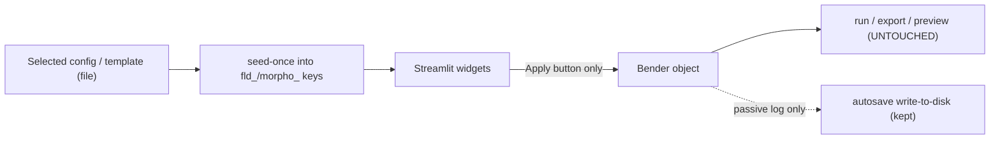

# One-way GUI data flow (C1-C4)

## Preconditions (verified)
- Branch `PC_Bender`, `git fetch origin` done, working tree clean, up to date with `origin/PC_Bender`.
- Caveat 1 confirmed: manual Load-snapshot and refresh-restore both call `_restore_snapshot_payload` (lines 1321, 1346) and are its ONLY two callers (re-grepped). Safe to remove as a unit.
- Caveat 2 confirmed: widgets seed-once (`if sk not in st.session_state`) from the `Bender` object; template injection bypasses this by overwriting `fld_*` directly.

## Locked decisions baked in
- Scope = C1-C4 only. C5 (H5 absolute config+protocol provenance) is split to a future schema task (touches `bender_routing_spec.py` + R pipeline).
- Decision C (config load): GUI-side shim via `importlib.util.spec_from_file_location` + `sys.modules` registration; `bender_functions.py` untouched. Shim MUST pop/overwrite `sys.modules[stem]` each load so an edited config reloads fresh.
- Decision A (seed source): staged template snapshot in session; Bender untouched until Apply.
- Decision D (config-builder): OUT OF SCOPE. File-loading applies to the main config-load path only; `read_base_defaults`/Build path stays import-by-name. Known limitation: building from a base config in a non-standard location still needs import-by-name.
- Decision E (dead code): leave `apply_template_to_session_state` / `inject_procedure_value_into_session_state` in place this pass; delete + update tests in a SEPARATE cleanup commit.

## Data-flow target

The only removed edges are disk/Bender -> widget (restore + template injection). No edge from Bender back into widgets at runtime.

---

## Commit sequence

### C1 - Remove restore-into-widgets (refresh-restore + manual Load-snapshot together) [Caveat 1]
- Goal: kill the disk -> widget direction in one unit so it cannot reappear via the manual button.
- Files: `bender_streamlit_gui.py`.
- Pre-check (done): `_restore_snapshot_payload` has exactly two callers (1321 manual, 1346 autosave). Proceed only because no third caller exists.
- Remove/neutralize:
  - `_restore_snapshot_payload` (1282), `_restore_autosave_payload` (1346), `_bootstrap_autosave_recovery` (1349), `_load_manual_snapshot` (1309), and the `_load_latest_autosave` (1333) consumer wiring.
  - The "Load snapshot" UI block (7117-7145: `gui_snapshot_file_pick`, `gui_manual_snapshot_path`, `gui_btn_load_snapshot`) and the `_bootstrap_autosave_recovery` call in the main render path.
- Keep: `_autosave_tick` (1381), `_collect_persistable_state` (1099), `_write_snapshot_payload`, `_save_progress_snapshot` (write-to-disk recovery log) and the "Save progress snapshot" button (7107).
- Replace recovery banner: on launch, if `autosave_latest.json` exists, show an informational banner pointing the operator to the on-disk snapshot file - do NOT auto-load it into widgets.
- Rig-validation: launch `streamlit run bender_streamlit_gui.py`; reload the browser mid-form and confirm fields reset to blank defaults (no silent restore); confirm autosave files still appear in `SessionSnapshots/`; confirm "Save progress snapshot" still writes a file.
- Rollback: `git revert <sha>` restores both restore paths together.

### C2 - Template loading: seed-once from a staged snapshot, procedure-scoped key-versioning [Caveat 2]
- Goal: load a protocol template by seeding procedure widgets once from the selected template (staged in session, Bender untouched until Apply), and rebuild ONLY procedure fields when the template selection changes.
- Files: `bender_streamlit_gui.py` (GUI stops calling the injection functions; the injection functions themselves stay - Decision E).
- Remove: the injection call inside `_consume_pending_protocol_template` (4242); stop calling `apply_template_to_session_state` / `inject_procedure_value_into_session_state` from the GUI render path.
- Add:
  - A staged "selected template snapshot" in session (e.g. `gui_protocol_template_loaded`) populated on Load.
  - `gui_fld_version` counter bumped on each Load.
  - Procedure-scoped versioned key: `_widget_key` (1923) appends `gui_fld_version` ONLY for procedure/protocol `fld_*` fields. Path fields (`gui_data_folder`, `gui_templates_folder`) and specimen-identity fields are NOT versioned. Reuse `_clear_fld_session_keys` (2646) as the clear step (clear-then-reseed equivalent).
- Modify: procedure seed functions (`_seed_isovelocity_stim_widget_state` 1947, the isometric/dynamic/frequency seeders, block-sequence seeder ~1814) to read seed values from the staged template snapshot when present, else fall back to `Bender` (preserves config-load seeding). Post-load field edits stay free (seed-once per version).
- Correction enforced: versioning is procedure-only so a template load CANNOT wipe `gui_data_folder` / `gui_templates_folder` / specimen identity (prevents reintroducing the datafolder-clearing bug).
- Verification checkpoint: confirm the datafolder-clearing-after-template-load bug is gone (suspected root cause: template Load `st.rerun()` + injection cascade dropping `gui_data_folder`). If it persists, diagnose before continuing.
- Rig-validation: load template A -> procedure fields populate; switch to template B -> procedure fields rebuild from B; edit a field -> value sticks; confirm `gui_data_folder`, `gui_templates_folder`, and specimen identity remain intact across the load; click Apply procedure -> Bender receives values.
- Automated tests: run the full test suite (seeding is backend-adjacent) and confirm green.
- Rollback: `git revert <sha>`.

### C3 - Two path boxes: Templates folder + Data folder (blank defaults, placeholder hints)
- Goal: replace the single shared-folder model with two explicit, blank-by-default boxes; must be independently rig-valid.
- Files: `bender_streamlit_gui.py`.
- Modify: `_render_data_folder_dropdown` (6838) -> add a sibling "Templates folder" input (`gui_templates_folder`, blank default, display-only `placeholder=`); keep "Data folder" (`gui_data_folder`). Placeholder text must never be read as a value (guard with `str(...).strip()`; ensure no fallback turns a placeholder into a real path).
- Modify: `_shared_experiment_dir` (1041) -> source protocol/morphometrics template listing/saving from `gui_templates_folder` (fallback to `default_templates_dir(_ROOT)`), NOT from `gui_data_folder`.
- Keep: H5 output composition (`_compose_output_h5_path` 2973) sourced from `gui_data_folder`.
- Independence check (correction): with only C1+C2+C3 applied (no C4 resolver yet), confirm protocol/morpho Load and Save still work using the two folder boxes with plain folder paths. If load/save cannot function without the C4 resolver, MERGE C3 into C4 and ship them as one commit.
- Rig-validation: leave both blank -> placeholders show, nothing resolves to a real path, no save/load fires; set Templates folder -> protocol/morpho lists populate from it and Save writes there; set Data folder -> H5 preview path uses it.
- Rollback: `git revert <sha>` (or, if merged, revert the combined C3+C4 sha).

### C4 - Filename-only resolution + file-based config load (shim) + fail-loud / confirm-overwrite
- Goal: bare filename joins to its folder; absolute path overrides; config `.py` loads by file with a fresh (non-cached) module each time.
- Files: `bender_streamlit_gui.py` (config resolution + UI).
- Add: a resolver helper - bare filename -> join to Templates folder (config/protocol/morpho) or Data folder (H5 output); absolute path used as-is.
- Modify: `_apply_loaded_config_module` (3251) / `_resolve_hardware_config_import_target` (3161) to load config via `importlib.util.spec_from_file_location` + `importlib.util.module_from_spec` + `spec.loader.exec_module`, then register under `sys.modules[stem]` BEFORE `Bender(stem)` runs (its internal `import_module(stem)` - backend, untouched - then picks up the file-loaded module). The shim MUST `sys.modules.pop(stem, None)` / overwrite on each load so an edited config reloads fresh (no stale cache). JSON templates keep existing path loaders.
- Modify (correction): Load = fail loud (file-not-found -> clear `st.error`, no silent fallback). Save (protocol/morpho/config) = confirm-before-overwrite AND show the resolved absolute path. Reuse the existing overwrite checkbox pattern (7712) and `_st_error_detail`.
- Rig-validation: load a config by bare name, by relative filename, and by absolute path -> all produce the same Bender; edit the config file on disk and reload -> new values load (proves `sys.modules` pop/overwrite works, no stale cache); load a missing file -> loud error; save over an existing template -> overwrite confirmation + resolved absolute path shown.
- Automated tests: run the full test suite (config-load is backend-adjacent), especially `tests/test_hardware_config_load.py`; confirm green.
- Rollback: `git revert <sha>`.

---

## STAYS UNTOUCHED (confirmation list)
- Run / export / motor / DAQ path: `bender_functions.py`, `bender_h5_export.py`, `bender_routing_spec.py`, `bender_gui_preview.py`, `bender_simulation.py`.
- Apply read-out path: `_apply_procedure_form_to_bender` (4229), `_apply_form_updates` (4223), `_apply_pair` (4197), specimen/morpho sync helpers, `Bender.update_metadata`.
- Save-template: `save_protocol_template`, `snapshot_bender_procedure`, `build_procedure_dict_from_updates` (`bender_protocol_templates.py`).
- Injection functions left in place this pass (Decision E): `apply_template_to_session_state`, `inject_procedure_value_into_session_state` (deleted later in the cleanup commit).
- Config-builder / Build path (Decision D): `read_base_defaults` and the generated-config flow stay import-by-name.
- Autosave write-to-disk: `_autosave_tick` (1381), `_collect_persistable_state` (1099), `_write_snapshot_payload`, `_save_progress_snapshot`.
- Density-preset -> `morpho_prof_rho` deferred flush: `_queue_morpho_prof_rho_widget_sync_from_preset` (1606), `_flush_pending_morpho_prof_rho_sync` (1618).
- `_widget_key` and per-widget seed functions remain (extended for PROCEDURE-only versioning in C2; path/specimen fields unversioned; behavior otherwise preserved).

## Separate later commits / future tasks (NOT this pass)
- Cleanup commit (Decision E): delete `apply_template_to_session_state` / `inject_procedure_value_into_session_state` and update `tests/test_workflow_robustness.py`.
- Future schema task (was C5): log the resolved absolute config + protocol path into H5 `01_Metadata`. Deferred because it touches `bender_routing_spec.py` (export routing contract; new attrs otherwise land in `99_Unrouted` with a loud warning) and the downstream R pipeline contract. Plan separately once the route key is agreed.
